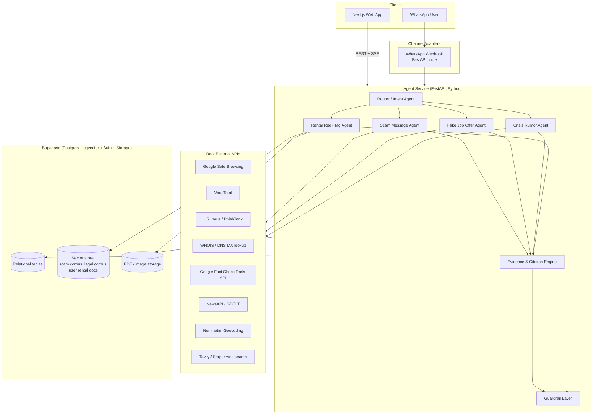

# SafeLine — Unified Trust & Safety Agent Platform
### Capstone Architecture & Build Plan (v1.0)

**Course repo specs used as the floor, not the ceiling:** Project_03 (Scam Message Safety Agent), Project_04 (Apartment Rental Agreement Red Flag Agent), Project_06 (Fake Job Offer Detector Agent), Project_01 (Crisis Rumor Verification Agent) — from `AAI_HIMSHIKHAR_2026_CP_July_2026`.

**Reference build studied:** `RithikSumbly/Scam_Identifier_Site` ("SafeGuard Nexus") — Next.js + Supabase + Gemini + SSE streaming + multi-source link reputation. We keep what's good there (structured verdicts, streaming, real threat feeds, RLS) and go further: four agents sharing one evidence-first core, a real location-aware crisis verifier, RAG over real legal text for rental agreements, and a WhatsApp channel.

---

## 0. What "better than the reference" actually means here

Being concrete about this up front, because it's what separates a real product from a wrapper:

1. **Every agent must cite evidence, not just the scam one.** One shared `AgentVerdict` schema — risk/status, confidence, red flags, **sources with URLs**, plain-English explanation, safe next action — used by all four agents. If an agent can't find evidence, it says "unverified," not a confident guess.
2. **The Crisis Rumor agent is a real cross-verification system**, not an LLM opinion. It resolves the user's location, pulls live news/fact-check/government-advisory data, and computes agreement/disagreement against the claim. This is the one you specifically flagged as needing to "actually work."
3. **The Rental agent uses real RAG**, not a vibes-based LLM read of pasted text — uploaded PDFs go into a vector store, get compared against a reference corpus of actual rent-control law text, and every red flag is grounded in a retrieved clause.
4. **One backend, two front doors.** A web landing page (rich UI: PDF upload, structured verdict cards, saved history) and a WhatsApp bot (the channel your actual target users live in) both call the same agent service. No duplicated logic.
5. **A real eval harness.** Each agent ships with 15–25 labeled test cases and precision/recall/false-positive numbers in the report — this is the "Validation using metrics" line every one of the four course docs lists as a minimum-acceptance criterion, and it's usually the first thing teams skip.

---

## 1. Product Shape: Landing Page *and* WhatsApp Bot (not either/or)

You asked whether to do a 4-tool landing page or a single chatbot. Do both, sharing one backend — they serve different moments:

- **Web app** — for anyone doing a careful review: pasting a long message, uploading a rental PDF, reading a detailed verdict with sources. Best for the demo video and grading.
- **WhatsApp bot** — for the actual real-world use case: someone forwards a suspicious message *to your bot* from inside WhatsApp, in the same place they received the scam/rumor/offer. This is genuinely higher-impact than a website for this problem domain, and it's also the thing that will make your demo memorable.

Both are thin clients over one **Agent Service** (FastAPI). No logic lives in the frontend or in the WhatsApp webhook handler beyond formatting.

---

## 2. High-Level Architecture



**Why this shape:** a single Router agent classifies incoming input (free text, forwarded message, PDF, image, or explicit tool selection on the website) and dispatches to one of four specialist agents. Every specialist agent is a LangGraph node with its own tool set, but they all terminate at the same Evidence & Citation Engine and Guardrail Layer, so output format and safety behavior are consistent everywhere — website, WhatsApp, doesn't matter.

---

## 3. Tech Stack (and why)

| Layer | Choice | Why |
|---|---|---|
| Frontend | Built in **Lovable** (React + Vite + TypeScript + Tailwind + shadcn/ui under the hood) | Fast to iterate visually, native Supabase integration for auth/history/document storage, exports real React code you can still hand to Cursor later if you need custom logic Lovable can't reach. See `LOVABLE_FRONTEND_PROMPT.md` for the full design brief and page-by-page spec. |
| Agent backend | Python 3.11 + FastAPI | Course track is "AAI" — Python is the expected substrate for the AI/agent logic; FastAPI is the industry-standard choice for LLM services and plays well with LangGraph |
| Orchestration | LangGraph | Explicit state machine per agent, built-in tool-calling, checkpointing for multi-turn WhatsApp conversations, easy to reason about (avoid opaque "autonomous agent" frameworks for a gradable capstone) |
| LLM | Anthropic Claude (Sonnet, via Messages API, tool use for structured JSON) — **or** Gemini 2.x Flash if you want a $0 option (Google AI Studio free tier) | Abstract behind one `LLMClient` interface so you can swap providers without touching agent code. Recommend picking one as primary and documenting the swap capability — that's a legitimate "industry practice" point for your report. |
| Database | Supabase (Postgres, `pgvector`, Auth, Row Level Security, Storage) | One managed service instead of gluing together 3 (DB + vector DB + auth) — free tier is enough for a capstone, and RLS gives you real per-user data isolation, which you can point to as a security decision in your report |
| Vector search | `pgvector` inside Supabase | No separate vector DB needed at this scale; keeps infra simple, still "real RAG" |
| WhatsApp | Twilio WhatsApp Sandbox for dev/demo → Meta WhatsApp Cloud API for anything closer to production | Meta's official Business verification can take days; Twilio sandbox gets you a working bot in under an hour. Document both paths, use Twilio for the demo video, mention Meta Cloud API migration in "future improvements." |
| Rate limiting / caching | Upstash Redis (free tier) | Protects your API quotas (Safe Browsing, NewsAPI etc. all have daily caps) |
| Deployment | Frontend → Vercel; Backend → Render/Railway (free tier) | Both trivial to set up, both fine to demo from |
| Background jobs | FastAPI `BackgroundTasks` or a simple cron (GitHub Actions scheduled workflow) for corpus refresh | Keep this lightweight — you don't need Celery for a capstone |

**Frontend/backend split, since the frontend is now built in Lovable rather than hand-coded in Cursor:** Lovable owns the UI, auth screens, and simple CRUD against Supabase directly (history, saved rental documents, profile) using its native Supabase integration — point it at the *same* Supabase project the `agent-service` uses, so there's one database, not two. Actual agent runs (scam check, job check, crisis check, rental analysis) are calls from the Lovable frontend to your deployed FastAPI `agent-service` endpoints (e.g. `POST /agents/scam`) — Lovable does not reimplement any agent logic, RAG, or tool-calling; it just renders whatever `AgentVerdict` JSON comes back. This keeps the "no fake data" principle intact: Lovable can ship fast with realistic mock data while `agent-service` is still being built in Cursor, then you swap the mock calls for real endpoint calls once both sides are ready.

---

## 4. Shared Core: the part that makes this "one product," not four demos

### 4.1 The `AgentVerdict` contract

Every agent — regardless of domain — returns this shape. This is the single most important design decision in the whole system: it's what lets one frontend, one WhatsApp formatter, and one eval harness serve all four agents.

```python
class EvidenceItem(BaseModel):
    source_name: str          # e.g. "PIB Fact Check", "Google Safe Browsing", "Rent Control Act, HP §5"
    source_url: str | None
    supports_claim: bool      # True = corroborates, False = contradicts
    snippet: str              # short grounding text, paraphrased, not scraped verbatim at length

class AgentVerdict(BaseModel):
    agent: Literal["scam", "job_offer", "crisis_rumor", "rental_redflag"]
    status: Literal["high_risk", "medium_risk", "low_risk", "likely_safe",
                     "confirmed", "likely_false", "unverified", "outdated"]
    confidence: float                     # 0-1, calibrated from evidence coverage, not vibes
    risk_score: int                       # 0-100, for UI badges
    red_flags: list[str]                  # short, specific, plain-English
    evidence: list[EvidenceItem]
    explanation: str                      # 2-4 sentences, non-jargon
    recommended_action: str               # what the user should actually do next
    needs_human_review: bool              # true when evidence is thin/conflicting
    disclaimer: str                       # domain-specific, e.g. "not legal advice"
```

### 4.2 Router / Intent Agent

- Input: raw text, optional file (PDF/image), optional location (lat/lon or free-text place).
- Classifies into `scam | job_offer | crisis_rumor | rental_redflag | general_help`.
- On WhatsApp, also supports explicit commands (`SCAM`, `JOB`, `CRISIS`, `RENTAL`) so users aren't fully dependent on classification — cheap accuracy win, and it's a good guardrail to write about in your report.
- Low-confidence classification → asks one clarifying question instead of guessing (this satisfies the course's "Ask missing questions if needed" flow step directly).

### 4.3 Guardrail Layer (shared, not per-agent)

- Never state a final verdict with zero evidence items — falls back to `unverified` + "here's how to check yourself."
- Strips/never stores OTPs, passwords, card numbers if pasted into a message (regex pre-filter before logging).
- Domain-specific disclaimers injected automatically: rental → "not a substitute for a lawyer"; crisis → "verify with official sources before acting"; scam/job → "when in doubt, don't click, don't pay, don't share OTPs."
- Escalation flag (`needs_human_review`) triggers a distinct UI treatment and a WhatsApp message pointing to the right authority (cybercrime.gov.in / 1930 helpline for financial fraud in India, local disaster helpline for crisis claims, etc.) rather than the agent trying to be the final word.

### 4.4 Evidence & Citation Engine

- Every tool call result gets normalized into `EvidenceItem`s before it reaches the LLM's synthesis step — this is what stops the model from hallucinating a source that wasn't actually retrieved.
- Dedupes and caps at ~5 evidence items per verdict so the UI stays readable.

---

## 5. Database Schema (Supabase / Postgres)

```sql
-- Identity (Supabase Auth handles the actual auth table; this extends it)
create table profiles (
  id uuid primary key references auth.users(id),
  phone_number text unique,          -- links WhatsApp identity to a web account (optional link)
  display_name text,
  created_at timestamptz default now()
);

-- One row per agent invocation, across web AND WhatsApp
create table agent_runs (
  id uuid primary key default gen_random_uuid(),
  user_id uuid references profiles(id),         -- nullable: guest usage allowed
  channel text check (channel in ('web','whatsapp')),
  agent text check (agent in ('scam','job_offer','crisis_rumor','rental_redflag')),
  input_text text,
  input_location jsonb,               -- {lat, lon, place_name} when relevant
  verdict jsonb,                      -- the full AgentVerdict, for audit + eval
  latency_ms int,
  created_at timestamptz default now()
);

-- Evidence sources retrieved per run (denormalized copy for fast querying/eval)
create table evidence_log (
  id uuid primary key default gen_random_uuid(),
  run_id uuid references agent_runs(id),
  source_name text,
  source_url text,
  supports_claim boolean,
  snippet text
);

-- User-uploaded rental agreements (private, RLS-protected)
create table rental_documents (
  id uuid primary key default gen_random_uuid(),
  user_id uuid references profiles(id),
  file_path text,                     -- Supabase Storage path
  original_filename text,
  jurisdiction text,                  -- e.g. "Himachal Pradesh", user-declared or inferred
  status text default 'processing',
  created_at timestamptz default now()
);

-- Chunked, embedded document text (pgvector)
create table document_chunks (
  id uuid primary key default gen_random_uuid(),
  document_id uuid references rental_documents(id),
  collection text check (collection in ('user_rental_doc','legal_reference','scam_corpus')),
  chunk_text text,
  embedding vector(1536),             -- match your embedding model's dimension
  metadata jsonb
);
create index on document_chunks using ivfflat (embedding vector_cosine_ops);

-- Community-visible outputs (opt-in) — e.g. "this scheme has been reported before"
create table community_reports (
  id uuid primary key default gen_random_uuid(),
  agent text,
  summary text,                       -- scrubbed of PII before insert
  risk_score int,
  created_at timestamptz default now()
);

-- Eval harness results, so your report can show real numbers
create table eval_runs (
  id uuid primary key default gen_random_uuid(),
  agent text,
  test_case_id text,
  expected_status text,
  actual_status text,
  correct boolean,
  run_at timestamptz default now()
);
```

Row Level Security: `agent_runs`, `rental_documents`, and `document_chunks` (collection = `user_rental_doc`) are scoped to `auth.uid() = user_id`. `legal_reference` and `scam_corpus` collections are public-read, admin-write only.

---

## 6. Agent Specs

### 6.1 Scam Message Safety Agent (main feature)

**Input:** pasted message text, and/or a URL, and/or a screenshot (OCR'd).

**Workflow:**
1. LLM extracts structured signals: `requested_action` (pay / click / share-OTP / call-back), `urgency_words`, `money_request`, `link_present`, `claimed_sender` (bank, govt scheme, courier, etc.).
2. If a URL is present → parallel real checks:
   - **Google Safe Browsing API** (free) — malware/phishing verdict
   - **VirusTotal API** (free tier, ~4 req/min) — multi-engine URL reputation
   - **URLhaus** (no key needed) — active malware URL feed
   - **PhishTank** (free, keyed) — phishing DB lookup
3. RAG lookup against `scam_corpus` collection — a vector store built from FTC scam guidance, RBI/cybercrime.gov.in advisories, and known scam-scheme write-ups you ingest once at setup. This is what lets the agent say *"this matches the pattern of the fake KYC-update scam"* instead of a generic risk score.
4. **Claim verification step** (this is the part you specifically asked for — "the agent should also be able to verify its claims"): if the message claims to be from a real scheme/company/bank (e.g. "PM Kisan Yojana," "SBI KYC update"), the agent runs a **web search tool** (Tavily or Serper API) restricted toward official/government domains to check (a) does this scheme exist, and (b) does the real scheme actually ask for what this message is asking for. The verdict then explicitly separates *"the scheme is real, but this message's request is not how the real scheme works"* from *"we can't find this scheme at all."*
5. Synthesize into `AgentVerdict`. `red_flags` are specific ("asks for OTP, which no legitimate bank ever does" beats "suspicious message").
6. Guardrail: never advise clicking a link to "verify" — always direct to the organization's official channel.

**Real APIs used:** Google Safe Browsing, VirusTotal, URLhaus, PhishTank, Tavily/Serper search, your Claude/Gemini LLM.

### 6.2 Fake Job Offer Detector Agent

**Input:** offer text and/or sender email/domain.

**Workflow:**
1. LLM extracts: `company_name`, `stated_salary`, `payment_requested` (registration fee, "training kit" cost, etc.), `contact_email_domain`, `urgency`.
2. **Domain checks (real, no fabricated data):**
   - WHOIS lookup (e.g. `whoisjson` free API or `python-whois`) — domain age is a strong signal; a "company" whose domain is 3 weeks old is a red flag.
   - MX/DNS record check (`dnspython`, free) — does the domain even have working corporate mail, or is contact routed through a free Gmail/Yahoo address pretending to be corporate?
3. **Company existence check** via web search tool — does this company have any independent presence (LinkedIn, news, official site) beyond the offer email itself?
4. RAG against the same `scam_corpus` collection (FTC job-scam guidance) plus a job-scam-specific sub-collection.
5. Synthesize `AgentVerdict`; flag "asks for payment before employment" as an automatic hard red flag regardless of everything else — this is close to a universal signal.

**Real APIs used:** WHOIS API, DNS lookup, web search tool, LLM.

### 6.3 Crisis Rumor Verification Agent (the one that has to *actually* work live)

This is the agent you specifically called out as needing to be a real, working, location-aware verifier — not a chat wrapper. Treat it as the technical centerpiece.

**Input:** forwarded crisis message text, and location — resolved from (in priority order) WhatsApp's native location-share, browser Geolocation API on web, or a typed place name/pincode.

**Workflow:**
1. **Claim extraction** (LLM, structured): `event_type` (flood/earthquake/exam leak/riot/health outbreak/school closure/etc.), `claimed_location`, `claimed_date_time`, `claimed_numbers` (casualties, closures), `claimed_source` ("govt has announced...", "my friend who works there said...").
2. **Geo-resolution** (Nominatim/OpenStreetMap, free, no key): reverse-geocode the user's actual location to district/state, and separately geocode the *claimed* location from the message. Compute a mismatch flag — a huge share of recirculated rumors are old news from a different place being re-forwarded as current/local.
3. **Parallel live evidence gathering:**
   - **Google Fact Check Tools API** (free, keyed) — searches the claim against the corpus of fact-checks already published by outlets like BOOM, AltNews, PIB Fact Check, etc. This is the single highest-value source for Indian crisis rumors and is genuinely live.
   - **NewsAPI.org or GNews** (free tier) — recent news filtered by extracted location + event keywords, last 72 hours.
   - **GDELT Project API** (free, no key, huge global event database) — good for disasters/conflict events specifically, cross-checks whether *any* real event matching this description registered anywhere in the last few days.
   - **Restricted web search** (Tavily/Serper with `site:` filters toward `pib.gov.in`, `ndma.gov.in`, and relevant state disaster-management sites) — for official confirmations/denials.
   - **Weather/disaster type claims** — call the weather tool for the resolved location as an extra corroborating/contradicting signal.
4. **Synthesis:** the LLM is given the claim's structured fields plus every evidence item side-by-side and is instructed to classify: `confirmed` / `likely_false` / `outdated` (real event, wrong current relevance) / `unverified` (no matching evidence either way). Confidence is derived from *how many independent sources agree*, not from LLM tone.
5. **Safe rewrite:** the agent drafts a short, calm message the user can send back into the group chat that forwarded the rumor — factual, sourced, no panic language. This is the actual "safe next step" the course docs ask for, made concrete.
6. Guardrail: for anything involving imminent physical danger with no corroboration either way (`unverified` + high urgency claim), the response leads with official emergency numbers rather than a confidence score.

**Real APIs used:** Google Fact Check Tools API, NewsAPI/GNews, GDELT, Nominatim, weather tool, restricted web search, LLM. **This agent has no synthetic fallback data path for its live checks** — if the APIs are down, it says so and returns `unverified` rather than guessing, which is itself a defensible design decision to write up.

#### 6.3.1 Live Data Sources — Where to Get Each One

**Fact-checking (highest value for Indian rumors — query this first for every claim):**
- **Google Fact Check Tools API** — Google Cloud Console → enable "Fact Check Tools API," free tier. Indexes fact-checks from IFCN-certified outlets — BOOM Live, AltNews, Vishvas News, Factly, PIB Fact Check — in one query. This alone covers a large share of viral Indian misinformation, so get this key first.
- **PIB Fact Check** directly — no public API, but pib.gov.in/PIBFactCheck has a searchable feed and an official X/Twitter account (@PIBFactCheck). Use the restricted web-search tool with `site:pib.gov.in` as a fallback when the Fact Check Tools API returns nothing.

**Live news cross-referencing:**
- **NewsAPI.org** — free tier (100 req/day); query the `everything` endpoint with location + event keywords, sort by `publishedAt`, filter to the last 72h.
- **GNews.io** — backup/redundancy for when NewsAPI's quota runs out during testing or the demo; similar query shape.
- **GDELT Project** — gdeltproject.org, fully free, **no API key required**. Use the GDELT 2.0 DOC API (`api.gdeltproject.org/api/v2/doc/doc`) — strong for disasters/unrest/large-scale incidents specifically, updates every 15 minutes.

**Government/official advisories (no API — use the restricted web-search tool with `site:` filters):**
- `site:ndma.gov.in` — National Disaster Management Authority, official disaster advisories.
- `site:pib.gov.in` — Press Information Bureau, official government statements/denials.
- State disaster management authority sites (e.g. `site:hpsdma.nic.in` for Himachal Pradesh) — add whichever states you support, same pattern as the rental agent's state tier.
- India Meteorological Department (`mausam.imd.gov.in`) — for weather/flood-type claims; check whether your existing weather tool already covers this before adding a separate scraper.

**Location resolution:**
- **Nominatim (OpenStreetMap)** — free, no key, but has a strict usage policy (max ~1 req/sec, must set a real `User-Agent` header) — read their usage policy before hammering it. Use for both reverse-geocoding the user's device location and geocoding the location named in the claim.

**Setup order:** Fact Check Tools API key first (covers the most ground per API), then NewsAPI/GDELT for anything too recent to be fact-checked yet, government `site:` searches as the fallback for claims fact-checkers haven't touched yet.

### 6.4 Apartment Rental Agreement Red-Flag Agent

**Input:** PDF (or photographed pages, OCR'd) of a rental agreement.

**Important scope note:** this agent should not reason *only* off state rent-control acts. A large share of real problems (unregistered/unstamped agreements, penalty clauses disguised as "liquidated damages," clauses that are simply void under general contract law) are governed by general Indian contract and property law, not the state-specific act. The corpus below is tiered specifically so the agent has full legal grounding, not just a narrow rent-control lens.

**Workflow:**
1. **Ingestion:** extract text (native PDF text layer, or OCR via Tesseract/`unstructured` for scanned docs) → chunk → embed → store in `document_chunks` under `collection='user_rental_doc'`, scoped to that user via RLS.
2. **Reference corpus (built once, shared across all users, three tiers — see 6.4.1 below):** Tier 1 general contract/property law (national, always retrieved), Tier 2 state-specific rent-control law (retrieved when jurisdiction is known), Tier 3 plain-English secondary guidance (supplementary, lower authority, always labeled as such). This lets the agent say "this clause conflicts with the notice-period norm under [state act, section]" *and* catch issues rent-control law doesn't even address.
3. **Clause extraction** (LLM + RAG): for each of a fixed checklist of clause types — security deposit amount/refund terms, notice period, lock-in period, rent-increase clause, maintenance/repair responsibility, painting/damage charges, early-termination penalty, dispute-resolution clause, stamping/registration status — retrieve the relevant passage from the user's document (if present) and the relevant reference passage from `legal_reference` across whichever tiers apply, then compare.
4. **General-legal-validity pass** (separate from the rent-control comparison): check each clause against Tier 1 principles regardless of state — is any clause void under general contract law (e.g. unlawful consideration, one-sided waiver of legal recourse), is a penalty/damages clause enforceable as drafted or does it look like an unenforceable penalty, and does the agreement itself meet basic validity requirements (properly stamped, registered if the term exceeds the statutory threshold). These are catches a rent-control-only agent would miss entirely.
5. **Risk labeling per clause:** red (clearly one-sided, contrary to legal norms, or potentially void/unenforceable) / yellow (unusual, worth negotiating) / green (standard) / missing (a clause or requirement that *should* exist but doesn't, e.g. no refund timeline, no mention of stamp duty).
6. **Suggested fix language:** for red/yellow clauses, the agent drafts a plain-English rewrite the tenant could propose — clearly labeled as a suggestion, not legal advice.
7. Guardrail: hard disclaimer on every response — "this is document literacy support, not legal advice; for a real dispute, consult a lawyer or your local legal aid" — and every citation states which tier grounded it (general law vs state-specific vs secondary guidance) so the user knows how authoritative each red flag is.

**Real APIs/tools used:** OCR (Tesseract/unstructured), embeddings + pgvector RAG (real, not simulated), LLM. No fabricated dataset — all legal reference text is real statutory/guidance text you ingest once.

#### 6.4.1 Legal Reference Corpus — What to Ingest (tiered, so the agent is genuinely legally competent, not just rent-control-literate)

**Tier 1 — General contract & property law (national, always applies, ingest this first — it's the foundation):**
- **Indian Contract Act, 1872** — the backbone for "is this clause even valid." Focus on: Section 10 (what makes an agreement a contract), Section 23 (agreements with unlawful object/consideration are void — catches exploitative clauses directly), Sections 73–74 (compensation for breach, and specifically the difference between enforceable liquidated damages and an unenforceable penalty — one of the most common real red flags, e.g. "forfeit entire deposit for any breach"). Full text at indiacode.nic.in.
- **Transfer of Property Act, 1882, Chapter V (Sections 105–117)** — the actual national statute governing leases of immovable property: lessor/lessee rights and duties, breach, termination — more fundamental than state rent-control law for many clause types. indiacode.nic.in.
- **Registration Act, 1908, Section 17** — leases exceeding one year *must* be registered to be legally enforceable; an unregistered long-term lease is one of the highest-value red flags this agent can catch, and most tenants don't know this rule exists. indiacode.nic.in.
- **Indian Stamp Act, 1899** (plus the relevant state Stamp Act, e.g. Himachal Pradesh Stamp Act) — inadequate stamp duty makes an agreement inadmissible as evidence in a dispute; check whether the document states its stamp duty status.
- **Model Tenancy Act, 2021** — the central government's model law many states are aligning toward; useful even in states with an outdated rent-control act. Official text via Ministry of Housing and Urban Affairs (mohua.gov.in) or indiacode.nic.in.

**Tier 2 — State-specific rent-control law (retrieved when jurisdiction is known/declared):**
- Pull the specific state's act as a PDF from indiacode.nic.in — e.g. Himachal Pradesh Urban Rent Control Act, 1987 (default jurisdiction). Support 2–3 states max for a capstone, documented explicitly, not silently assumed — e.g. add Delhi Rent Control Act, 1958 and Maharashtra Rent Control Act, 1999 for breadth in the demo.

**Tier 3 — Plain-English secondary guidance (supplementary only, always cited as lower-authority than Tier 1/2):**
- **NALSA** (nalsa.gov.in) — National Legal Services Authority's plain-language legal aid guides, including tenancy rights explainers; good for translating statute into red-flag language a non-lawyer understands.
- Reputable legal-guidance sites (India Filings, Vakilsearch, ClearTax legal guides) publish "what to check in a rental agreement" articles — paraphrase/summarize rather than bulk-ingest, respect ToS, and always label this tier distinctly so users know it's guidance, not statute.

**Ingestion note:** chunk by clause/section, not fixed character length, so retrieval returns coherent legal provisions; store `act_name`, `section`, and `tier` in each chunk's `metadata` so every red flag can cite e.g. *"Indian Contract Act, 1872 §74 (Tier 1 — general law)"* or *"HP Urban Rent Control Act, 1987 §4 (Tier 2 — state law)"* rather than a vague reference. Retrieval strategy: always query Tier 1, add Tier 2 when jurisdiction is set, fall back to Tier 3 only to fill explanatory gaps.

---

## 7. WhatsApp Bot

**Recommended for build/demo:** Twilio WhatsApp Sandbox (works in minutes, free, fine for a course demo).
**Documented as the production path:** Meta WhatsApp Cloud API (official, needs Business verification — mention in "future improvements," don't block your timeline on it).

**Flow:**
1. Incoming webhook (`POST /whatsapp/webhook`) receives text, image, PDF, or location share, keyed by phone number.
2. Look up or create a lightweight session (last N turns) keyed on phone number in `agent_runs`/a small `whatsapp_sessions` table, so the bot has short-term memory within a conversation (LangGraph checkpointing keyed by phone number works well here).
3. Router agent classifies → dispatches to the right specialist agent exactly as the web app does.
4. Response formatted for WhatsApp (short, uses emoji sparingly for risk level — 🟥/🟨/🟩 — full explanation and sources as text, since WhatsApp doesn't render rich cards without approved templates).
5. First-time users get a one-line onboarding message explaining the four things the bot can do and that they can just forward anything suspicious to find out.

This is genuinely the differentiator versus your reference project (which is web-only) and versus most classmates' submissions — say so explicitly in your report and demo video.

### 7.1 WhatsApp Setup — Step by Step

**Path A — Twilio Sandbox (use for dev/demo, live in ~30 min):**
1. Sign up at twilio.com (free trial credit).
2. Console → Messaging → Try it out → **Send a WhatsApp message** → gives you a sandbox number + a join code (e.g. "join happy-tiger").
3. From your own phone, WhatsApp that join code to the sandbox number — links your number to the sandbox for testing.
4. Console → Sandbox Settings → set **"When a message comes in"** webhook to `https://<your-deployed-agent-service>/whatsapp/webhook` (POST). For local dev, tunnel with `ngrok http 8000` and paste the ngrok URL here.
5. `pip install twilio`. The incoming webhook gives you `From`, `Body`, `MediaUrl0` (images/PDFs), `Latitude`/`Longitude` (location shares) as form-encoded POST fields — parse with FastAPI's `Request.form()`.
6. Reply with `twilio.twiml.messaging_response.MessagingResponse` (simplest — return TwiML directly) or the REST API (`client.messages.create(...)`) if you need to send async/proactive messages.
7. Limits: only numbers that joined can message you, and Twilio shows a "this is a sandbox" banner — fine for demo, not for real users.

**Path B — Meta WhatsApp Cloud API (production path, don't block your timeline on this):**
1. developers.facebook.com → create a Meta App → add the **WhatsApp** product.
2. Meta gives you a free test number immediately — no Business verification needed just to test with up to 5 manually-added recipient numbers.
3. Get a temporary access token (24h) from the API Setup page, or a permanent one via a System User in Business Settings for anything longer-lived.
4. Set your webhook URL + a verify token in the app dashboard; Meta sends a GET verification challenge first — your route must echo `hub.challenge` when `hub.verify_token` matches.
5. Incoming messages arrive as JSON (different shape from Twilio — nested under `entry[0].changes[0].value.messages[0]`); media needs a follow-up GET to `graph.facebook.com/v20.0/{media-id}` for the download URL.
6. Full Business verification (needed to message anyone without pre-adding their number, and to lift rate limits) can take days — exactly why Twilio is the right choice for your demo video.

Both paths feed the same `/whatsapp/webhook` route in `agent-service` — only the payload parser differs.

---

## 8. External Services Checklist

| Service | Used by | Free tier? | Get it here |
|---|---|---|---|
| Anthropic Claude API *or* Google AI Studio (Gemini) | all agents | Gemini: yes, generous | console.anthropic.com / aistudio.google.com |
| Google Safe Browsing API | Scam agent | Yes | Google Cloud Console |
| VirusTotal API | Scam agent | Yes (4 req/min) | virustotal.com |
| URLhaus | Scam agent | Yes, no key | urlhaus.abuse.ch |
| PhishTank | Scam agent | Yes, keyed | phishtank.org |
| WHOIS API (whoisjson or similar) | Job agent | Yes (limited) | whoisjson.com |
| Google Fact Check Tools API | Crisis agent | Yes | Google Cloud Console |
| NewsAPI.org or GNews | Crisis agent | Yes (100–250 req/day) | newsapi.org / gnews.io |
| GDELT | Crisis agent | Yes, no key | gdeltproject.org |
| Nominatim (OpenStreetMap) | Crisis agent | Yes, rate-limited, no key | nominatim.org |
| Tavily or Serper (web search) | Scam, Job, Crisis agents | Yes (limited) | tavily.com / serper.dev |
| Supabase | all | Yes | supabase.com |
| Twilio WhatsApp Sandbox | WhatsApp bot | Yes | twilio.com |
| Upstash Redis | rate limiting | Yes | upstash.com |

Every item on this list is a real, working, freely-available API — nothing here needs to be faked or stubbed for the demo.

---

## 9. Repository Structure

```
safeline/
├── apps/
│   ├── web/                        # Next.js frontend
│   │   ├── app/
│   │   │   ├── (tools)/scam/
│   │   │   ├── (tools)/job/
│   │   │   ├── (tools)/crisis/
│   │   │   ├── (tools)/rental/
│   │   │   ├── dashboard/
│   │   │   └── api/                # thin proxy routes to agent-service if needed
│   │   └── components/
│   └── whatsapp-webhook/           # could live inside agent-service instead — see note below
│
├── services/
│   └── agent-service/               # FastAPI + LangGraph
│       ├── app/
│       │   ├── main.py
│       │   ├── router_agent.py
│       │   ├── agents/
│       │   │   ├── scam.py
│       │   │   ├── job_offer.py
│       │   │   ├── crisis_rumor.py
│       │   │   └── rental_redflag.py
│       │   ├── tools/               # one file per external API wrapper
│       │   ├── core/
│       │   │   ├── schemas.py       # AgentVerdict, EvidenceItem
│       │   │   ├── guardrails.py
│       │   │   ├── llm_client.py    # provider-agnostic wrapper
│       │   │   └── evidence_engine.py
│       │   ├── rag/
│       │   │   ├── ingest_scam_corpus.py
│       │   │   ├── ingest_legal_corpus.py
│       │   │   └── retriever.py
│       │   ├── whatsapp/
│       │   │   └── webhook.py       # keep it in the same service — one deploy, one source of truth
│       │   └── db/
│       │       └── supabase_client.py
│       ├── tests/
│       │   └── eval/                # labeled test cases + scoring script, per agent
│       └── requirements.txt
│
├── data/
│   ├── scam_corpus_sources/         # raw FTC/cybercrime.gov.in text before ingestion
│   ├── legal_reference_sources/     # raw rent-control law text before ingestion
│   └── eval_test_cases/             # per-agent labeled examples (real or clearly-marked synthetic)
│
├── docs/
│   ├── project_report.md
│   ├── architecture.md              # this file, trimmed
│   └── responsible_use.md
│
└── README.md
```

**Note on WhatsApp webhook placement:** keep it inside `agent-service` (same FastAPI app, different route) rather than a separate microservice — one deployable, one source of truth for agent logic, less surface area to keep in sync. Split it out later only if you actually need to scale it independently.

---

## 10. Build Order (this is the part that keeps four agents + a bot from collapsing)

The course wants ten days per project; you're building four plus a shared channel. Don't build all four in parallel from scratch — build the shared spine once, then agents become fast to add.

**Phase 0 — Spine (days 1–4):** Supabase project + schema + RLS; `agent-service` skeleton with `AgentVerdict`/`EvidenceItem` schemas, `llm_client.py`, `guardrails.py`; Router agent with keyword/command fallback; one working end-to-end path (any single agent, simplest version) through both the web app and Twilio sandbox. Prove the plumbing before adding complexity — if the WhatsApp round-trip works for one agent, it works for all four.

**Phase 1 — Scam Message Agent, full depth (days 5–9):** this is your main topic; build it completely, including the claim-verification web-search step and the scam-corpus RAG. Get its eval harness (15–20 labeled examples) working here first — you'll reuse the harness pattern for the other three.

**Phase 2 — Fake Job Offer Agent (days 10–12):** reuses the scam corpus pattern and the web-search tool almost directly; mainly new work is the WHOIS/DNS checks. Should be fast.

**Phase 3 — Crisis Rumor Agent (days 13–17):** the most technically involved due to geo-resolution + multi-source live evidence gathering. Budget the most time here since it's also your most differentiated feature.

**Phase 4 — Rental Red-Flag Agent (days 18–21):** the RAG/document-ingestion pipeline is new work; clause-comparison logic reuses the `AgentVerdict` pattern directly.

**Phase 5 — Polish (days 22–25):** landing page pass, WhatsApp onboarding message, eval numbers written up in the report, guardrail edge cases, demo video.

If time runs short, the four agents are independently droppable in reverse order (Rental → Crisis → Job) without breaking the spine — Scam stays as your guaranteed complete deliverable since it's the stated main topic.

---

## 11. Guardrails & Responsible Use (for the required section in every one of the four course docs)

- No agent ever tells a user to click a link, call a number, or enter credentials "to verify" — verification paths always point to the organization's own official channel.
- Financial-fraud-in-progress or immediate-danger signals short-circuit straight to authority contact info (India: cybercrime.gov.in / 1930 for financial fraud; local emergency numbers for crisis claims) rather than waiting on a full agent pipeline.
- PII (OTPs, card numbers, passwords) pasted into any agent is regex-stripped before logging, never stored raw.
- Every verdict carries an explicit disclaimer proportional to the domain's stakes (rental = "not legal advice," crisis = "verify further before acting," scam/job = general caution language).
- `needs_human_review` is a first-class field, not an afterthought — surfaced distinctly in both the web UI and WhatsApp replies.
- Rate limiting (Upstash) on both the web API and the WhatsApp webhook to prevent runaway API-quota burn and basic abuse.

---

## 12. Evaluation Plan

For each of the four agents: a `data/eval_test_cases/<agent>.jsonl` file with 15–25 real-style examples (a mix of genuine scam/rumor/offer/agreement text pulled from public write-ups, clearly cited, plus a handful of clean/benign controls), each with an expected `status`. A scoring script runs the agent against all of them and reports accuracy, false-positive rate (flagging something safe as risky), and false-negative rate (missing something genuinely risky) — false negatives matter most in this domain and should be called out explicitly in your report. Results land in the `eval_runs` table so you can show a real table/chart, not a claimed number.

---

## 13. Deliverables Mapping (so nothing in the course rubric gets missed)

Each of the four course docs asks for the same list — satisfy it once, at the product level, rather than four times:

- GitHub repo (monorepo above) ✅
- Dataset/reference material: scam corpus sources, legal reference sources, eval test cases — all real, sources cited in `data/*/README.md` ✅
- README with problem statement, architecture, how to run, results, limitations ✅
- One project report covering all four agents + the WhatsApp integration as one product, with a clear "AI/agent logic" section per agent ✅
- One presentation deck: problem → architecture → the four agents → WhatsApp demo → eval numbers → limitations/responsible use → future work ✅
- One demo video: show the web app for the scam agent (main topic, full depth), then a live WhatsApp exchange for at least the crisis agent, then a rental PDF upload ✅
- `requirements.txt` / `package.json` ✅
- Screenshots + eval results table in `docs/project_report.md` ✅

---

## 14. Kickoff Prompt for Cursor

Paste this as your first message in Cursor once the repo is scaffolded, then work phase by phase from Section 10 rather than asking for everything at once:

> Build the Phase 0 spine described in `CAPSTONE_ARCHITECTURE_PLAN.md`: a FastAPI service at `services/agent-service` with the `AgentVerdict`/`EvidenceItem` Pydantic schemas from Section 6.1, a provider-agnostic `llm_client.py` (support both Anthropic and Gemini via env var), a `guardrails.py` implementing the checks in Section 11, and a Router agent that classifies free text into one of `scam | job_offer | crisis_rumor | rental_redflag | general_help` with a keyword-command fallback (`SCAM`, `JOB`, `CRISIS`, `RENTAL`). Set up the Supabase schema from Section 5 with RLS as described. Then build the Scam Message Safety Agent from Section 6.1 end-to-end, including the Google Safe Browsing + VirusTotal + URLhaus tool calls and the web-search claim-verification step, and wire it through both a minimal Next.js page and a Twilio WhatsApp sandbox webhook so the same agent answers on both channels. Don't stub any external API — use real free-tier keys from the checklist in Section 8, loaded from `.env`.

---

## 15. Open Decisions to Confirm Before Building

1. **LLM provider** — Claude (better structured tool-calling, paid) vs Gemini (free tier, slightly more setup friction for structured output). Pick one as primary now; the abstraction layer means switching later is cheap.
2. **Team size / scope** — if solo, seriously consider shipping Phases 0–2 (spine + Scam + Job) at full depth and Phases 3–4 at reduced depth (skip the geo-resolution nuance in Crisis, skip OCR for scanned rental PDFs) rather than doing all four shallowly. Depth on fewer agents beats breadth with weak evidence-grounding everywhere.
3. **Jurisdiction for the rental agent** — defaulting the legal reference corpus to Himachal Pradesh/general Indian tenancy law unless you want it broader; narrower is more defensible for a capstone than trying to cover every state.
